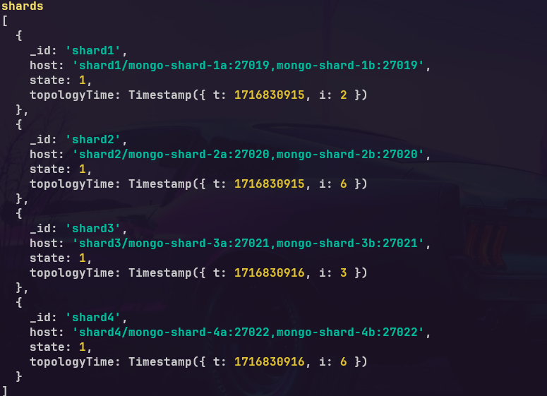

<h1 align="center">Cluster MongoDB utilizando o Docker</h1>
<p align="center">Projeto tem como o objetivo aplicar conceitos de dados em um amiente de banco de dados distruido. Projentando um sistema escalável e eficientemente particionado para lidar com um grade volume de dados.</p>
</br>

<h2>Cenario</h2>
<p>O cenario utilizado é um sistema de gerenciamento de estoque para uma cadeia de supermarcados que possui filiais em diferentes cidades, para isso será utilizado um Cluster de MongoDB no Docker.</p>

<h3>Roteadores:</h3><p>Servidores de Configuração, recebendo a requisição de leitura e escrita e direcionar para a sua partição.</p>
<h3>Shards:</h3><p>Partições de Dados, são os responsaveis por armazenar os dados, cada Shard fica responsavel por um subconjunto de dados no MongoDB.</p>
<h3>ConfigServers:</h3><p>Guardar os metadados das partições (shards).</p>
<p>Para esse projeto será criado um roteador, três ConfigServers e três shards contendo mais dois shards como replicá totalizando 9 Shards no total.</p>



<h3>Antes de criar o roteador, vamos criar uma rede e colocar todos os containers na mesma rede, para que não ocorra nenhum problema de comunicação entre eles.</h3>

```shell
docker network create mongo-vicentin-network-ro
```
<h2>Criando os ConfigServers</h2>
<h4>ConfigServer1</h4>

```shell
docker run --name mongo-config1 --net mongo-vicentin-network-ro -d mongo mongod --configsvr --replSet configserver --port 27018
```
<h4>ConfigServer1</h4>

```shell
docker run --name mongo-config2 --net mongo-vicentin-network-ro -d mongo mongod --configsvr --replSet configserver --port 27018
```
<h4>ConfigServer1</h4>

```shell
docker run --name mongo-config3 --net mongo-vicentin-network-ro -d mongo mongod --configsvr --replSet configserver --port 27018
```

