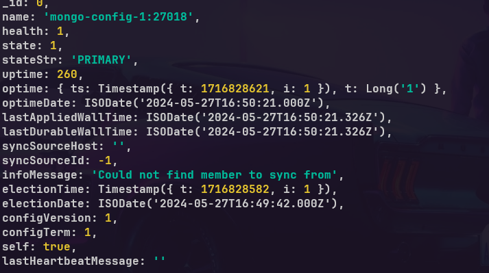
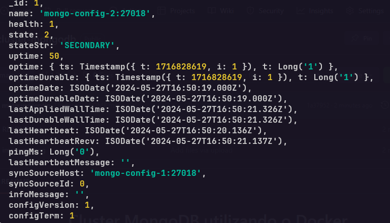
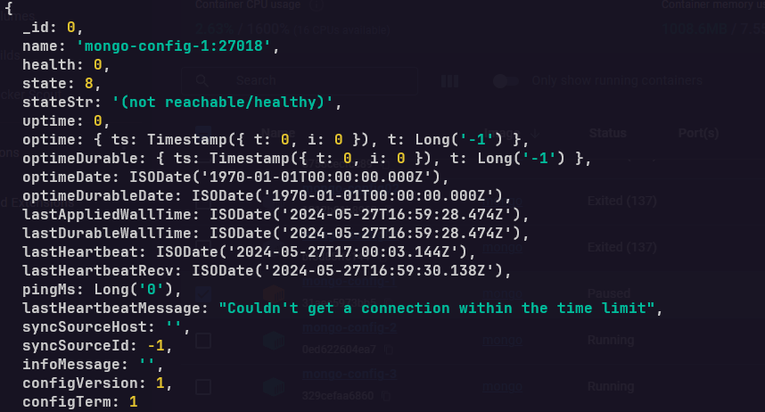
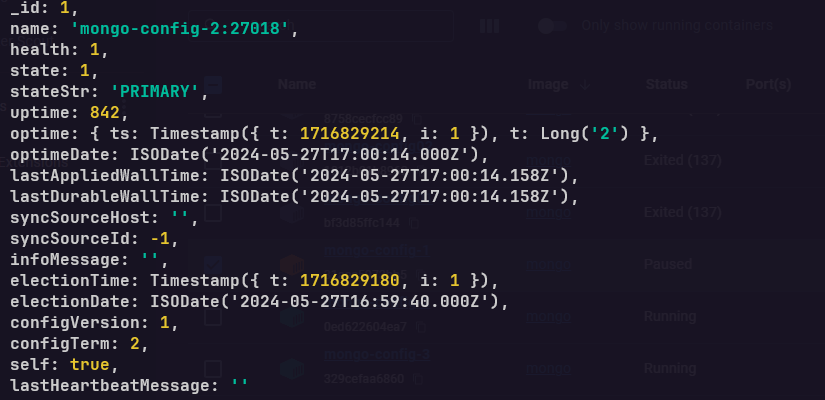

<h1 align="center">Cluster MongoDB utilizando o Docker</h1>
<p align="center">Projeto tem como o objetivo aplicar conceitos de dados em um amiente de banco de dados distruido. Projentando um sistema escalável e eficientemente particionado para lidar com um grade volume de dados.</p>
</br>

<h2>Cenario</h2>
<p>O cenario utilizado é um sistema de gerenciamento de estoque para uma cadeia de supermarcados que possui filiais em diferentes cidades.</p>
<p>Para isso será utilizado três tipos de serviços diferentes, que são:</p>
</br>

<h3>Roteadores:</h3><p>Responsáveis pelas requisições de escrita e leitura.</p>
<h3>Shards:</h3><p>Guardar os objetos no banco de dados.</p>
<h3>ConfigServers:</h3><p>Guardar os metadados do nosso cluster.</p>


<h2>Criando o Roteador(Cluster)</h2>

```shell
docker network create mongo-vicentin-network
```
<h2>Criando o ConfigServers</h2>
<h3>Criando o Primeiro </h3>

```shell
docker run --name mongo-config-1 --net mongo-vicentin-network -d mongo mongod --configsvr --replSet configserver --port 27018
```

<h3>Criando o Segundo</h3>

```shell
docker run --name mongo-config-2 --net mongo-vicentin-network -d mongo mongod --configsvr --replSet configserver --port 27018
```

<h3>Criando o Terceiro</h3>

```shell
docker run --name mongo-config-3 --net mongo-vicentin-network -d mongo mongod --configsvr --replSet configserver --port 27018
```

<h3>Criando o Quarto</h3>

```shell
docker run --name mongo-config-4 --net mongo-vicentin-network -d mongo mongod --configsvr --replSet configserver --port 27018
```


<p>Apos isso é configurado apenas um dos três containers do ConfigServer, irei usar o Primeiro como exemplo.</p>

```shell
docker exec -it mongo-config-1 mongosh --port 27018
```

```shell
rs.initiate(
   {
      _id: "configserver",
      configsvr: true,
      version: 1,
      members: [
         { _id: 0, host : "mongo-config-1:27018" },
         { _id: 1, host : "mongo-config-2:27018" },
         { _id: 2, host : "mongo-config-3:27018" },
         { _id: 3, host : "mongo-config-4:27018" }
      ]
   }
)
```
<p>Apos a criação dos quatros containers responsaveis pela configuração do servidores, é utilizado o comando "rs.status()" afim de verificar como ficou a configuração dos containers.</p>

```shell
rs.status()
```


<p>No exemplo acima, o container chamado "mongo-config-1" é o Primario, ou seja. Ele é o principal para fazer os processos dentro do MongoDB, e o restante dos servidores são os Secundarios, ou seja. Caso o "mongo-config-1" sofra por interrupção os algum dos outros três assume. Exemplos a baixo.</p>

<h3>Antes de derrubar: </h3>




<h3>Apos derrubar: </h3>




<p>A troca de servidores está funcionando, apos um cair e o outro assumir, sendo assim podemos dar continuidade na configuração, agora a criação dos Shards</p>

<h3>Shard 1</h3>

```shell
docker run --name mongo-shard-1a --net mongo-vicentin-network -d mongo mongod --port 27019 --shardsvr --replSet shard1
```

```shell
docker run --name mongo-shard-1b --net mongo-vicentin-network -d mongo mongod --port 27019 --shardsvr --replSet shard1
```

<h3>Shard 2</h3>

```shell
docker run --name mongo-shard-2a --net mongo-vicentin-network -d mongo mongod --port 27020 --shardsvr --replSet shard2
```

```shell
docker run --name mongo-shard-2b --net mongo-vicentin-network -d mongo mongod --port 27020 --shardsvr --replSet shard2
```

<h3>Shard 3</h3>

```shell
docker run --name mongo-shard-3a --net mongo-vicentin-network -d mongo mongod --port 27021 --shardsvr --replSet shard3
```

```shell
docker run --name mongo-shard-3b --net mongo-vicentin-network -d mongo mongod --port 27021 --shardsvr --replSet shard3
```

<h3>Shard 4</h3>

```shell
docker run --name mongo-shard-4a --net mongo-vicentin-network -d mongo mongod --port 27022 --shardsvr --replSet shard4
```

```shell
docker run --name mongo-shard-4b --net mongo-vicentin-network -d mongo mongod --port 27022 --shardsvr --replSet shard4
```

<p>Apos a criação será configurado e iniciado cada um dos shards, para isso é feito uma configuração parecido com a que foi feita nos Servidores, no caso será necessario acessar cada um dos quatro Shards.</p>

<h3>Shard 1</h3>

```shell
docker exec -it mongo-shard-1a mongosh --port 27019
```
<h3>Shard 2</h3>

```shell
docker exec -it mongo-shard-2a mongosh --port 27020
```
<h3>Shard 3</h3>

```shell
docker exec -it mongo-shard-3a mongosh --port 27021
```
<h3>Shard 4</h3>

```shell
docker exec -it mongo-shard-4a mongosh --port 27022
```
